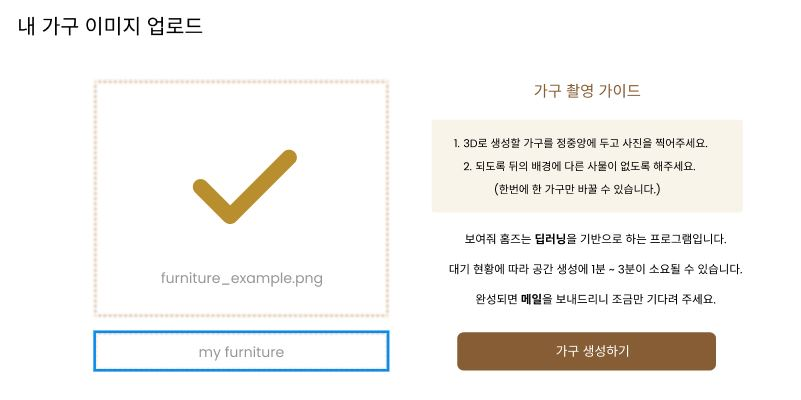
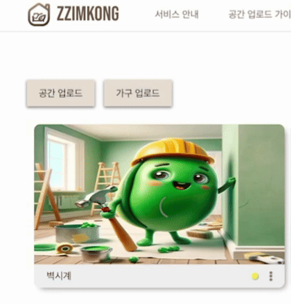
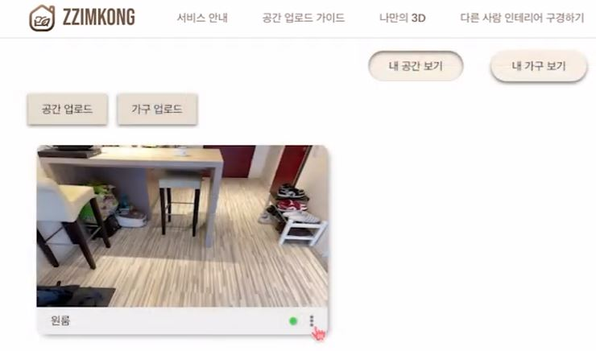
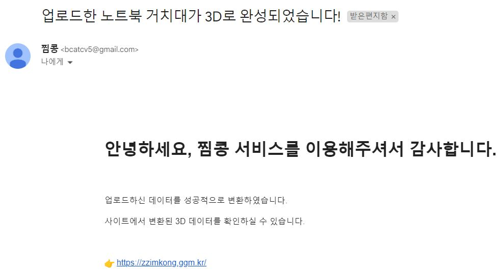
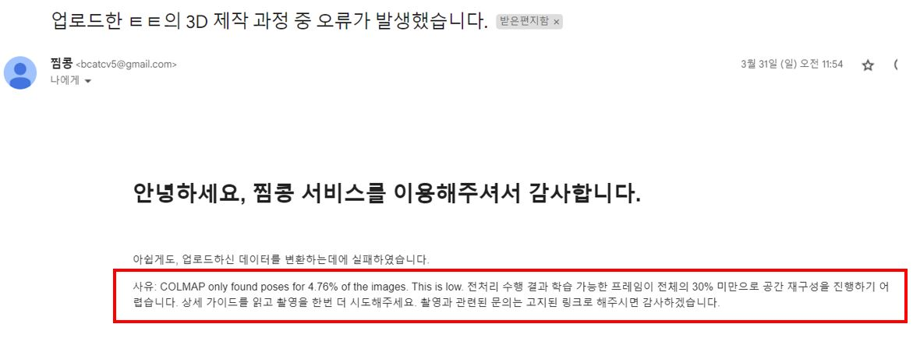
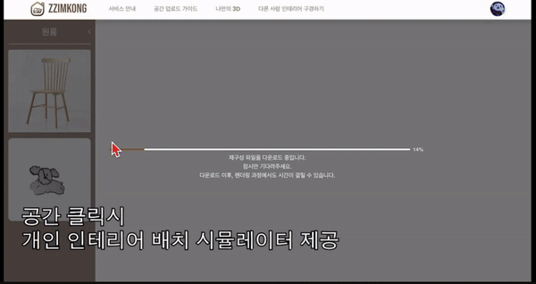
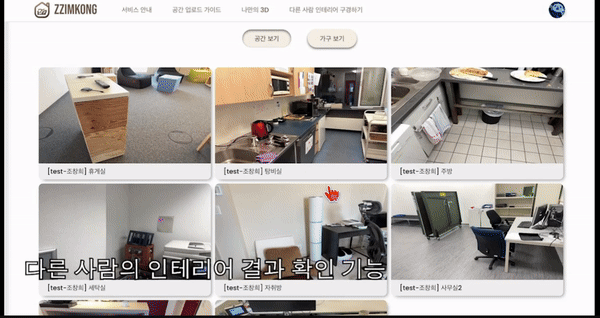
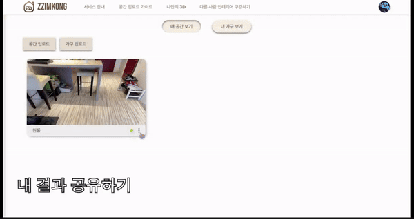

By <a href="https://github.com/SangBeom-Hahn" style="color: white;">SangBeom</a>

 

 

    

        
찜콩

        
맞춤형 주거 공간

        
가상 인테리어 시뮬레이션 서비스

        <!-- 
콩냥팡냥이의 러블리 하우스
 -->
    

    

<!-- (여기서부터는 글자 크기 1.5와 1) -->
     

 

    

        
가상 공간 재구성과

        
시각화

        
3D 공간 재구성 AI에 따른 인테리어 디자인을 3D 가상 환경에서

        
실시간으로 시각화

        
실제 사용자가 찍은 공간 기반

        
인테리어 기능 제공

    

    

        
인테리어 시뮬레이터

        
사용자 취향에 따라 가상 공간에

        
원하는 가구를 배치하며

        
인테리어 가능

    

    

        
공간과 가구 인테리어 갤러리

        
마음에 드는 인테리어 디자인을 

        
저장하고 다른 사용자와 아이디어

        
공유

        
갤러리에 있는 공간과 가구도
        
        
3D 입체화로 렌더링 제공

    

   

    
공간 재구성

    

        
        
재구성 효율이 높은 최적의 공간 영상 촬영 

        
가이드 제공

    

    

        
        
최적의 가구 영상 촬영 가이드 제공

        
내부적으로 객체 탐지, 배경 제거를 적용하여 사용자 편의성 제공

    

  

    
    
모바일 업로드 기능 제공

   

    
    
모델 인퍼런스 실시간 진행 상황 모니터링

   

    
    
공간 및 가구 재구성 리스트 조회

    
모델 재구성 성공, 실패 여부 조회

    
   

  

    
  

  

    
  

    
모델 재구성 성공 및 실패 여부 이메일 알림

   

    
인테리어 배치 시뮬레이터

    
    
재구성 완료된 공간 클릭 시 인테리어 시뮬레이터 제공

    
가구 선택 후 배치, 회전, 크기 조절, 위치 이동, 복제 및 다른 종류 가구 배치

    
배치 체크포인트 자동 저장

   

    
인테리어 갤러리

    
    
다른 사용자들의 인테리어 결과 조회

 

  
  
내 결과 공유, 가구 재구성 만족도 평가

  
회원가입 전, 시뮬레이터 데모, 갤러리 구경 등 서비스 탐색 가능

  

구성원 소개

  
  

    <a href="https://github.com/woohee-yang" style="font-weight:bold; font-size: 18px;">양우희</a>
    
Modeling

  

  
  

    <a href="https://github.com/jinida" style="font-weight:bold; font-size: 18px;">이영진</a>
    
Modeling, 3D Landering

  

  
  

    <a href="https://github.com/cmj5064" style="font-weight:bold; font-size: 18px;">조민지</a>
    
Modeling

  

  
  

    <a href="https://github.com/ccsum19" style="font-weight:bold; font-size: 18px;">조수민</a>
    
Modeling, 3D Landering

  

  
  

    <a href="https://github.com/hee000" style="font-weight:bold; font-size: 18px;">조창희</a>
    
FrontEnd, Backend

  

  
  

    <a href="https://github.com/SangBeom-Hahn" style="font-weight:bold; font-size: 18px;">한상범</a>
    
Backend, Model Pipeline

  

